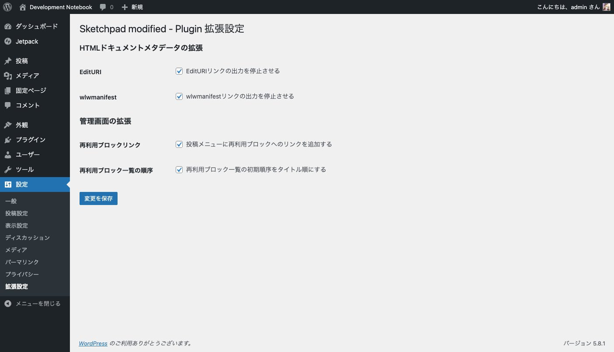

# Sketchpad modified - Blocks

 

Custom plugin for myself.

## Feature
 - Stop the output of EditURI link
 - Stop the output of wlwmanifest link
 - Add a link to the Reusable Block in the post menu
 - Set the initial order of the Reusable Block list to title order
